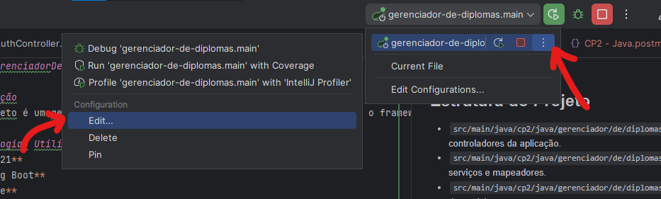
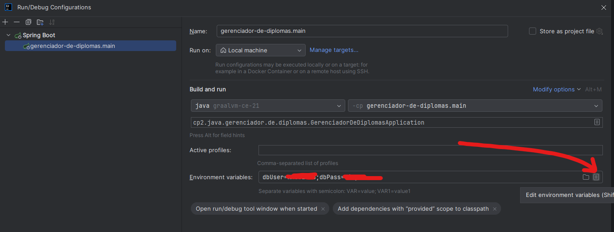
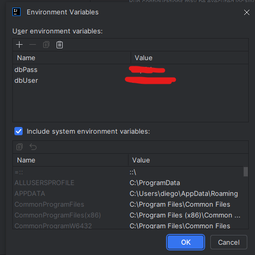

# JAVA-GerenciadorDeDiplomas

## Integrantes do Grupo

* **[Diego Costa Silva RM552648](https://www.linkedin.com/in/diegocostacs/)**
* **[Lucas Minozzo Bronzeri RM553745](https://www.linkedin.com/in/lucas-minozzo-bronzeri-b212a4248/)**

## Descrição
Este projeto é um gerenciador de diplomas desenvolvido em Java utilizando o framework Spring Boot. Ele permite registrar, buscar, atualizar e deletar diplomados, seus diplomas e os cursos da Universidade Fake. :D

## Tecnologias Utilizadas
- **Java 21**
- **Spring Boot**
- **Gradle**
- **Oracle JDK 11**

## Estrutura do Projeto
- `src/main/java/cp2/java/gerenciador/de/diplomas/controller`: Contém os controladores da aplicação.
- `src/main/java/cp2/java/gerenciador/de/diplomas/service`: Contém os serviços e mapeadores.
- `src/main/java/cp2/java/gerenciador/de/diplomas/model`: Contém as classes de modelo.
- `src/main/java/cp2/java/gerenciador/de/diplomas/repository`: Contém os repositórios para acesso ao banco de dados.

## Endpoints
### Você pode acessar os endpoints e testar na pasta `documentation/Endpoints-postman` e abrir o arquivo .json em seu Postman.

## Como Executar
1. Clone o repositório:
    ```sh
    git clone https://github.com/DiegoCostaCode/JAVA-GerenciadorDeDiplomas.git
    ```
2. Este projeto utiliza banco de dados **Oracle**. Coloque no build.gradle, a dependência de seu banco de dados. Ou, se preferir, pode utilizar o banco de dados **H2**.

   
3. Ao finalizar o BUILD, você deve setar as variáveis de ambiente para o banco de dados Oracle, se aplicável:
   1. 
   
   2. 
   
   3. 


4. Execute o projeto:
   `Shift+F10`